## DIP_LAB_WORKS
**1. Develop a program to display grayscale image using read and write operation.**
```python
import cv2
#Gray scale Img
gray_img=cv2.imread(r'Methi.jpg',0)
cv2.imshow('Gray_Img',gray_img,)
cv2.waitKey(0)
cv2.destroyAllWindows()
```
***output:***
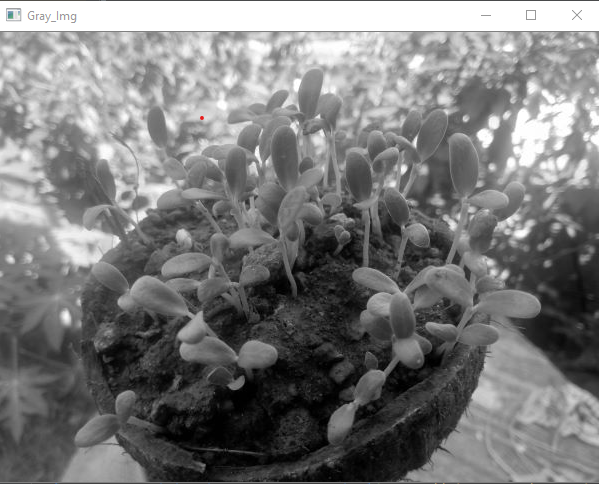
---

**2. Develop a program to perform linear transformations on an image: Scaling and Rotation**
```python
org_img = cv2.imread(r'Methi.jpg')
#Scaling
cv2.imshow('Original_Img',org_img)
cv2.waitKey(0)
h,w = org_img.shape[:2]
cv2.imshow('Decreased_Resized_Img',cv2.resize(org_img,(w//2,h//2), interpolation=cv2.INTER_AREA))
cv2.waitKey(0)
cv2.imshow('Increased_Resized_Img',cv2.resize(org_img,(w+100,h+50), interpolation=cv2.INTER_AREA))
cv2.waitKey(0)
#Rotation
center=(w//2,h//2)
M=cv2.getRotationMatrix2D(center,90,1)
rot_img=cv2.warpAffine(org_img,M,(w,h))
cv2.imshow('Rotated_Img_90',rot_img)
cv2.waitKey(0)
M=cv2.getRotationMatrix2D(center,127,1)
rot_img=cv2.warpAffine(org_img,M,(w,h))
cv2.imshow('Rotated_Img_127',rot_img)
cv2.waitKey(0)
cv2.destroyAllWindows()
``` 
***output:***
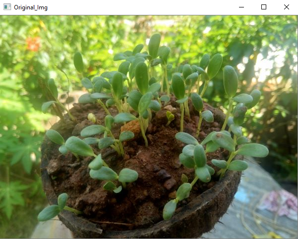

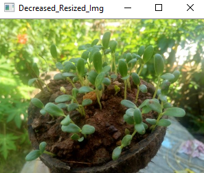

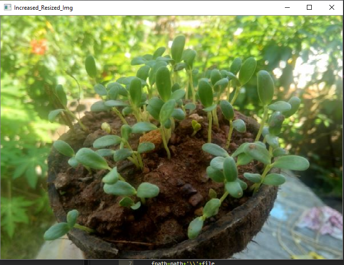

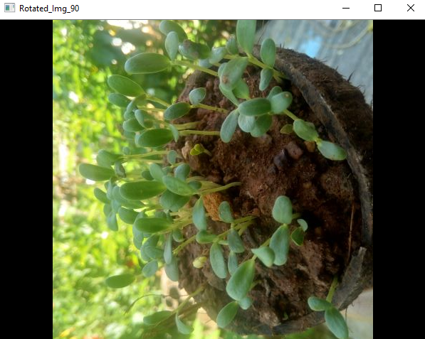

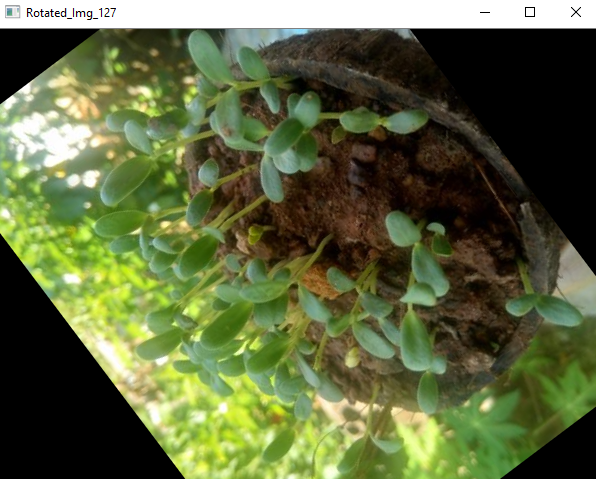

---

**3.Develop a program to find the sum and mean of a set of images. 
Create ‘n’ number of images and read them from the directory and perform the operations.**
```python
#sum & Mean
import os
path=r'C:\Users\Sanjay-PC\DIP\DIP_Lab_Works\img_dir'
imgs=[]
files=os.listdir(path) #List
for file in files:
    fpath=path+'\\'+file
    imgs.append(cv2.imread(fpath))
    
for i,im in enumerate(imgs):
    cv2.imshow(files[i],imgs[i])    
    cv2.imshow('Mean of '+files[i],len(im)/im)
print('sum of imgs(Total no) = ',i+1)    
cv2.waitKey(0)
cv2.destroyAllWindows()
```
```
sum of imgs(Total no) =  3
```
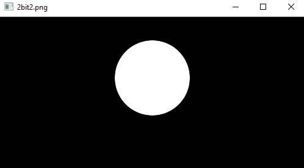

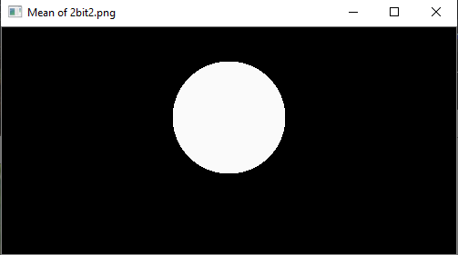

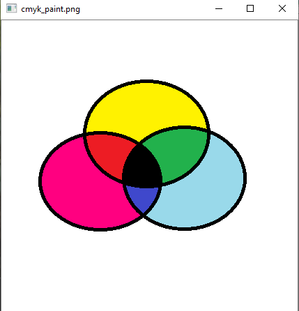

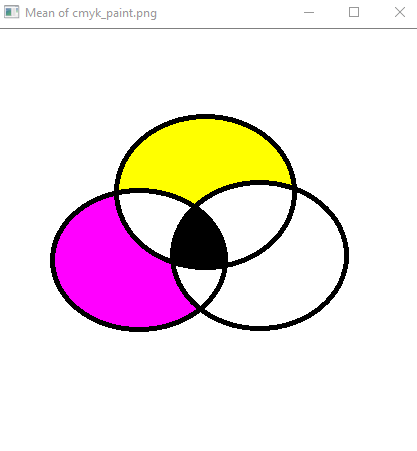

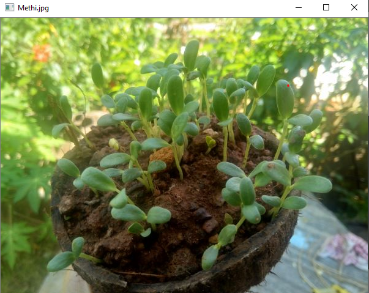

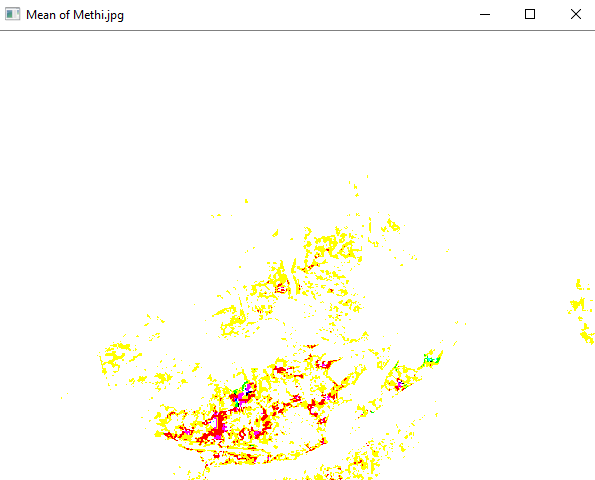


**4.Develop a program to convert the color image to gray scale and binary image.**

**BGR to Gray**
```python
#Gray Scale
color_img=cv2.imread('Alas2.jpg')
cv2.imshow('Original',color_img)
cv2.waitKey(0)
cv2.imshow('Gray_scale',cv2.cvtColor(color_img,cv2.COLOR_BGR2GRAY))
cv2.waitKey(0)
```
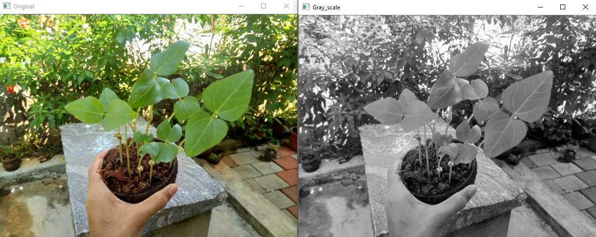


**Faster_code**
```python
#Faster code/direct
fast_gray_img=cv2.imread('Alas2.jpg',0)
cv2.imshow('Faster_gray',fast_gray_img)
cv2.waitKey(0)
```
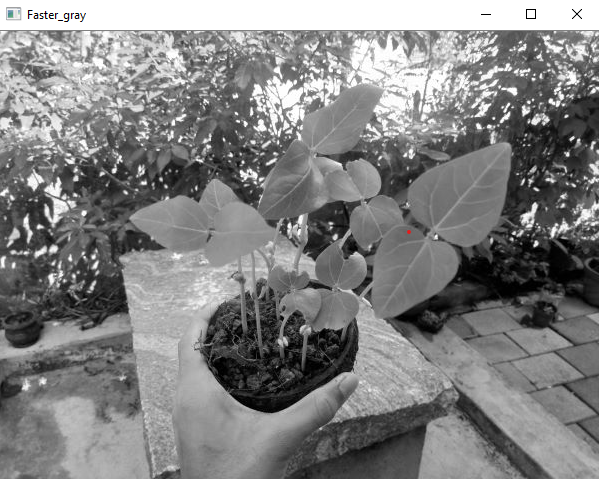


**Gray scale to Binary**
```python
#Gray to Binary
retval,bin_img=cv2.threshold(fast_gray_img,127,255,cv2.THRESH_BINARY)
cv2.imshow('BIN_Img',bin_img)
cv2.waitKey(0)
cv2.destroyAllWindows()
```
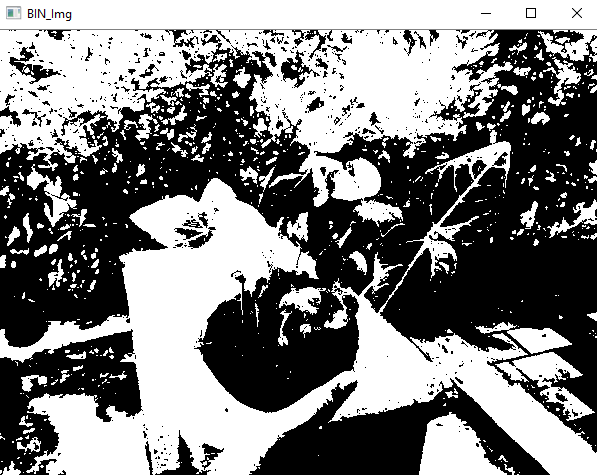


**5.Develop a program to convert the given color image to different color spaces.**
```python
#color-sace
o_img=cv2.imread('cmyk_paint.png')
#BGR
cv2.imshow('BGR',o_img)
cv2.waitKey(0)
#HSV
cv2.imshow('HSV',cv2.cvtColor(o_img, cv2.COLOR_BGR2HSV))
cv2.waitKey(0)
cv2.imshow('LAB',cv2.cvtColor(o_img, cv2.COLOR_BGR2LAB))
cv2.waitKey(0)
cv2.destroyAllWindows()
```
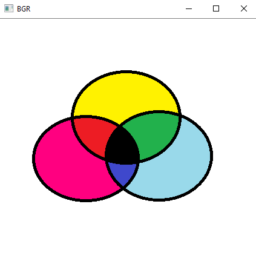

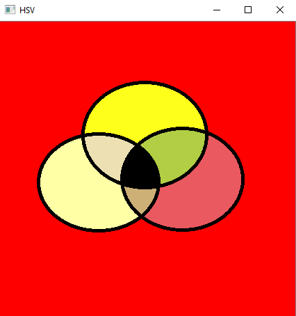

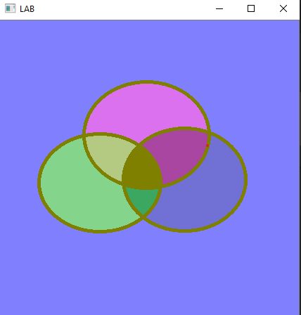
---
**6.Develop a program to create an image from 2D array (generate an array of random size).**
```python
#Create_Img
import numpy as np
img_arr=np.random.randint(255,size=(300,500),dtype=np.uint8) #Random 2D Array
cv2.imshow('img_arr',img_arr)
cv2.waitKey(0)
cv2.destroyAllWindows()
```
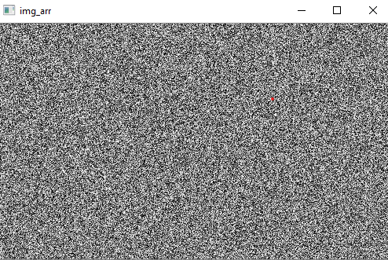
